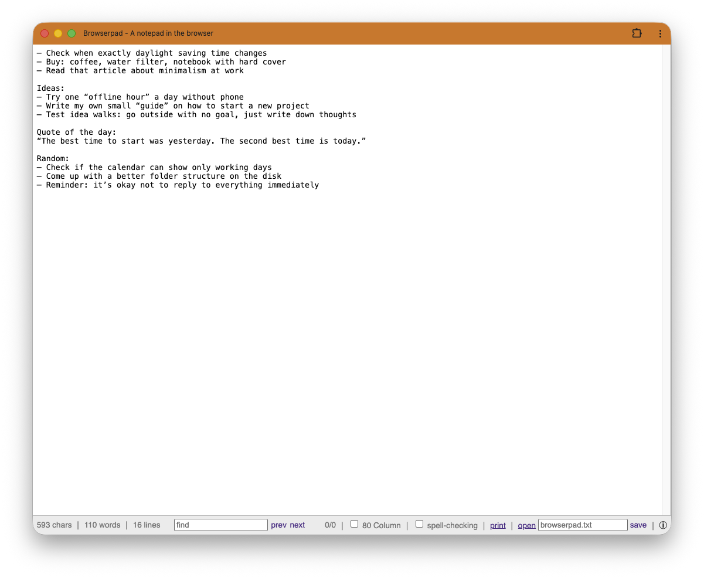

# Browserpad

Browserpad is a notepad in the browser - a private place for quick notes.
The source code is based on [browserpad.org](https://github.com/Browserpad/browserpad).

## Screenshot



## Getting Started

1. Install dependencies:
	```bash
	npm ci
	```
2. Start the development server:
	```bash
	npm run dev
	```
3. Open the app in your browser.

## Build

```bash
npm run build
```
